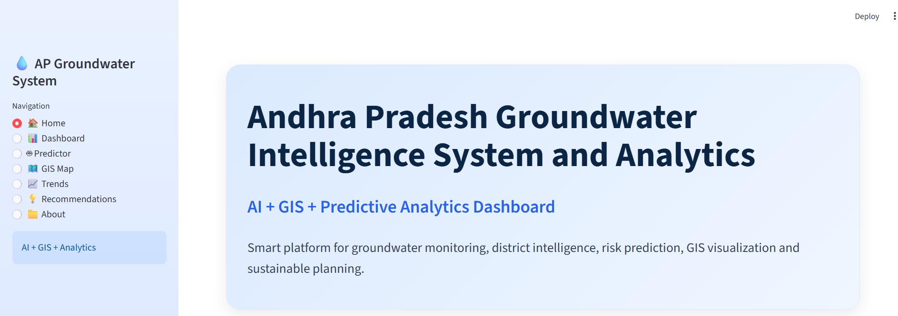
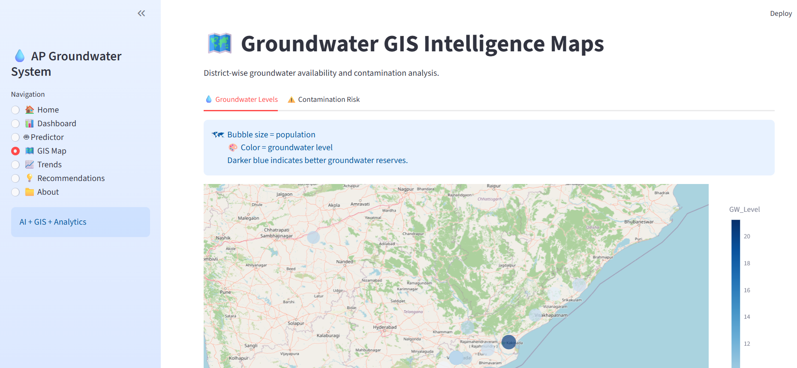
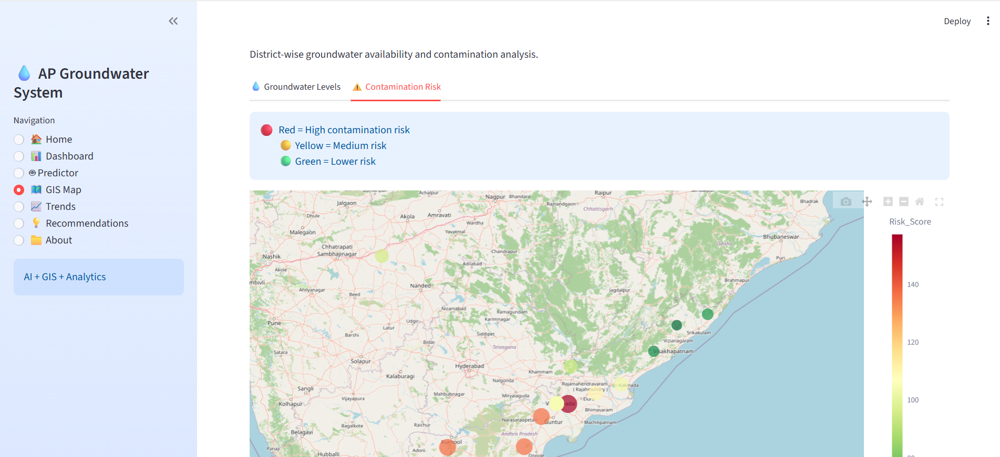
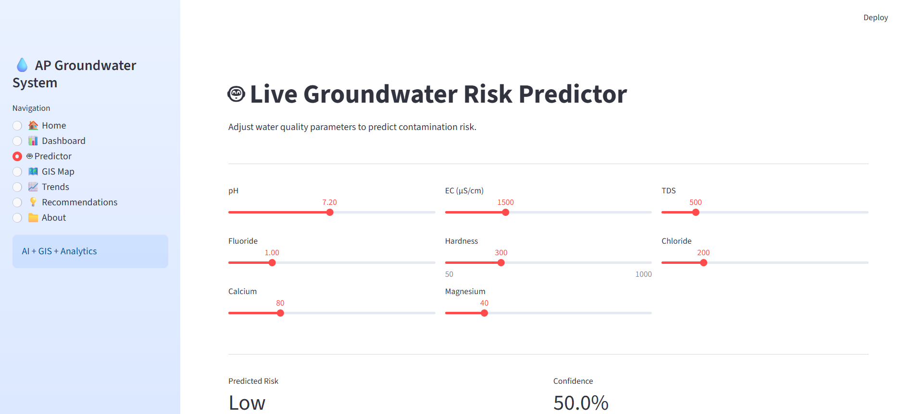

# Groundwater Intelligence System

## Overview
A bilingual (English/Telugu) web application to monitor groundwater conditions across districts.

## Features
- Interactive dashboards
- GIS-based visualization
- Machine learning-based predictions for water stress

## Tech Stack
Python, Streamlit, Machine Learning, Data Visualization, GIS

## Purpose
To improve accessibility of groundwater data for farmers and agricultural stakeholders.

## Screenshots

### Dashboard Overview

### Groundwater Levels Visualization

### Contamination Analysis

### Prediction Results
